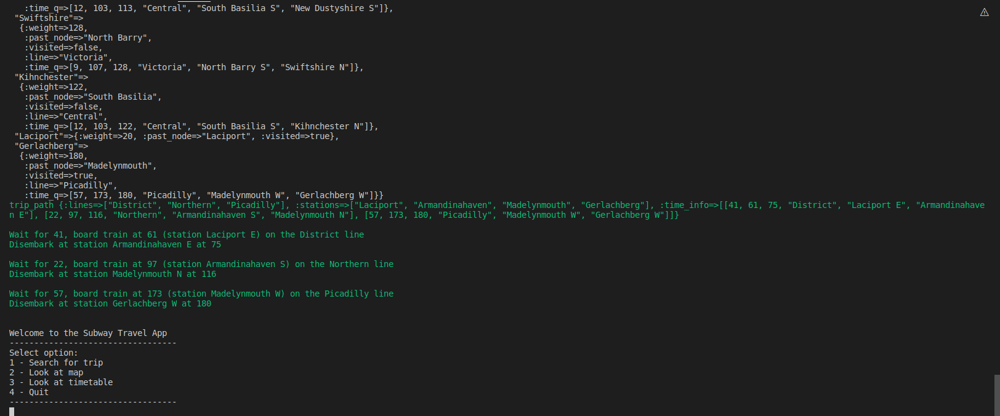
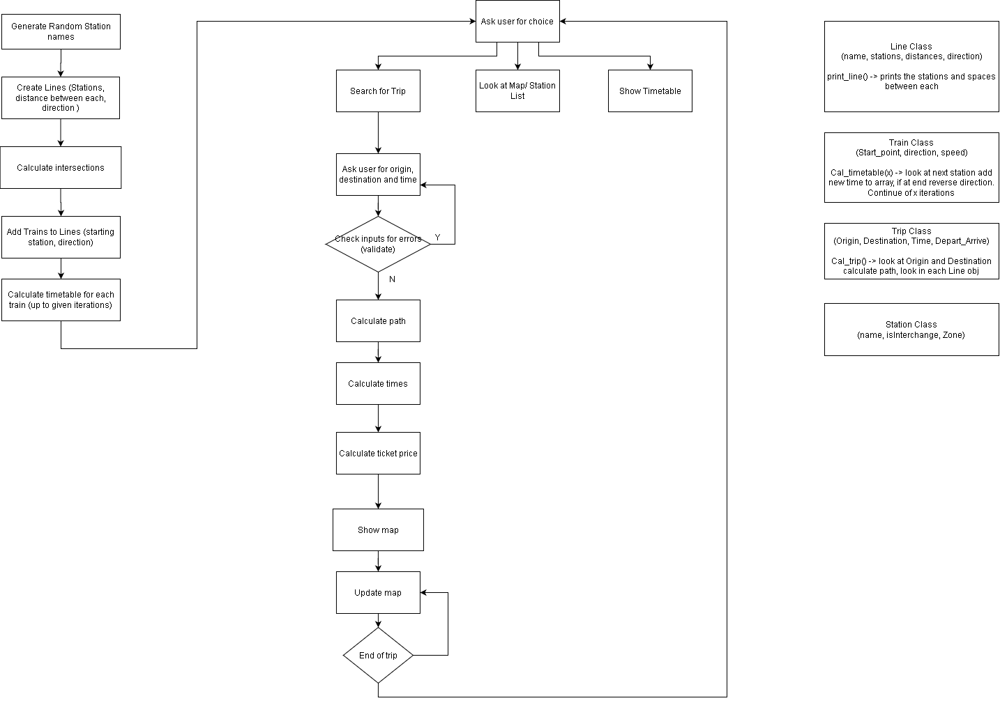
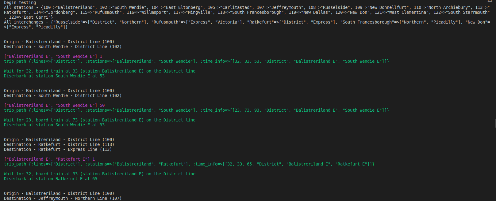

# Software Development Plan

## Purpose and Scope
My idea for the terminal project is to create an application for a subway trip planner. The purpose of this application is to help commuters in travelling on the right train. The program will ask the user for a origin, destination and departure time which will calculate the path that they have to take and which train to catch.

The user will get information on what time to leave the platform, how many stops before changeover or destination, what time they will arrive and the cost of the ticket.

### List of features

The application generates a number of objects to use and interact with each other. Each station is an object containing a name, a station number and if it is an intersection. The line object contains a line name, the list of station objects that are on that line, distances between each station and direction. The train objects are placed on these lines by passing the line object and the stating station number when creating it.

When the user enters the trip details, the application will use Dijkstra's algorithm to calculate the optimal path. Dijkstra's algorithm works by making each of the intersection, origin and destination a 'node'. The algorithm will pass through the nodes and calculate the weight or time taken to get to each node until the destination is reached. 

The other features are printing out the map and timetables. Printing the map looks at each line and displays the places where the stations are and the distances between each. The timetables are printed by looking at each train object and displaying it's timetable. 

### User interaction

When the program starts the map and menu is printed. The user selects the options search for trip, display map, timetable or quit by typing numbers. When searching for trip the user inputs origin, destination, depart by or arrive by and the time. The program takes these inputs, outputs the directions for the trip and returns back to the menu.

The other menu options are to display the map, which prints the map again. The timetable option prints the timetables for each train. Lastly, the quit option breaks of the program loop and quits.

With all of these inputs, there is validation and error checking. When entering the station numbers, the application checks if the station number exists in the hash of all of the stations. If there is no station, a StandardError is raised and it retrys by asking the origin and destination. Also, if a string is entered instead of a station number an error the TypeError is raised and retrys. When entering the depart time, a TimeError is raised if the time can not be found on the timetable.

### Control Flow Diagram

Main control flow diagram for complete program

# Status Updates
## Update 1

I have had trouble in figuring out how to implement the Trains in the program. My idea is to have the Trains be a child of each of the lines that they are assigned to. Just figuring out how to calculate the timetables for each train. I think that I can write a function in the Train object and access the variables from the Line object

Another problem that I am having is trouble with searching for the stations in all_stations hash. I have a function called search_station that passes in keys to read the hash. I received an error saying 'undefined local variable or method all_stations'. I have solved this by passing the all_stations as a argument of the function.

## Update 2

I encountered a problem when creating the train objects. When it is created it places itself at a station and given a direction. The error had occurred when I had placed the Train at the last station on a 'NS' line with a direction going 'S'. I plan to correct this problem by changing the direction accordingly when the Train object is initialized or it reaches the last or first station.

## Update 3

I had some trouble trying to work out how to calculate the path to the destination. I had created a diagram to help me through this problem:

In this example, there is a list of stations that are intersections (s1,s2,etc.) and a list of paths that they connect to ([a,b],[a,c]) respectively. The path to be calculated is to go from path 'a' to 'z', so the program starts with path 'a'. Each of the intersections are looked at to see if any of them include 'a' and are merged into the array. The process repeats by looking at the intersections and searching for the last item of each path (in this case 'b' and 'c'). The intersections that have already been used have to be ignored to prevent continuous looping (eg. [a,b,a,b,a,b...]). All of this repeats until 'z' is found.

Through out the assignment, I had used Trello to help my planning. The initial board is shown with all the requirements and planned features.

As I has completed the tasks I had moved each item through the testing and completed lists.

## Update 4 - Further work

The MVP of the application is complete, however there are some features that could have been implemented if given more time:
* adding the map with the positions of the trains shown and animating it by printing and clearing the screen.
* adding a text-to-speech to read the instructions as time goes by
* being able to calculate multiple paths and selecting the least travel time option
* placing the interchanges information in the line objects so that only a selection of them are viewed when calculating the trip, not all of them.
* adding arrive-by time and search function
* adding returning multiple results for trip queries
* displaying the time correctly (6:00 am instead of 1)
* adding number of stations until destination and ticket price

## Update 5 - Revisiting assignment

I had revisited this assignment as I had learnt Dijkstra's algorithm in class and wanted to implement it. As it had been a couple of months since I had completed the assignment I had to refresh my knowledge of Ruby and how my code executed. The trip object had to be mostly rewritten as the previous code didn't fit well with Dijkstra's. I had made a nodes object in the Trip class that contained the intersections, origin and destination and had followed the algorithm by updating the weights when each node is visited. With this sorted I was able to calculate the optimal path with the option to select arrive by and depart by.

Furthermore, I had also implemented random map generation. A map array of 50x40 is created and populated with up to 6 generated lines randomly placed. I had set a number of rules for the creation: lines parallel to each other can't be too close, stations on the lines can't be too close, lines intersect if they are in each others range and the start and finish of the line has to be within the map borders. With the random map, the algorithm works being able to calculate the optimal path.

# Help File
### Steps to install
To be able to run the ruby program, Ruby has to be installed.
    
    sudo apt-get install ruby

To check if you already have ruby installed type:

    ruby -v

The gem 'bundler' has to be installed as well.
    
    gem install bundler

If the application isn't already downloaded it can be cloned from github.

    git clone https://github.com/ChrisWhite12/Terminal_app.git

When those are installed, run the script.
    
    bash run.sh

## Explanation of features
### Main menu

When the application starts, the main menu will be displayed. By typing the number of the item that the user wishes to select (eg. 1 for Search for Trip) and pressing Enter will run that option.

### Searching for trip

When selecting the 'Search for Trip' option, the application will ask for the Origin and Destination of the trip. Enter the numbers that correspond to the stations that are displayed in the map. An Error will show if incorrect values are entered and will try again. The option to Arrive by or Depart by is asked next and is selected by entering A or D. The time is asked after that and requests a number which represents the number of minutes past the starting point (eg.1 is 6:00 and 71 is 7:10)

The application will calculate the path to take and what times to board the trains.

### Display map

Selecting the Look at Map option will print the map of all the stations.

### Display timetable

Selecting the Look at Timetable option will show all the trains and their timetables, displaying which line they are on and the stations that they arrive at.

### Testing
    
Testing is run by writing 'testing' as an argument when starting.

    ruby main.rb testing

For the Test, different types of paths and times are input into trip object and the path is calculated. The tests are given below:

    if (testing)                    #test different trip requests
        begin

        print "All stations - #{Station.all_stations}\n"
        print "All interchanges - #{Station.all_interchange}\n"
        print "\n"

        trip1 = Trip.new(100,102,1)                       #same line
        trip2 = Trip.new(100,102,50)                      #same line, different time
        trip3 = Trip.new(100,113,1)                       #same line, destination is interchange
        trip4 = Trip.new(100,112,1)                       #different line
        trip5 = Trip.new(113,106,1)                       #different line, origin is interchange
        trip6 = Trip.new(106,117,1)                       #go through 4 different lines
        trip7 = Trip.new(102,120,1)                       #unreachable station
        trip8 = Trip.new(100,102,1500)                    #same line, time doesn't exist

        Trip.all_trip.each{|trip|
            trip.cal_trip()
        }

        # if error occurs print an error
        rescue TimeError
            print "Invalid time \n"
        rescue StandardError
            print "Station number does not exist \n"
        end

    end

The results are shown below:

